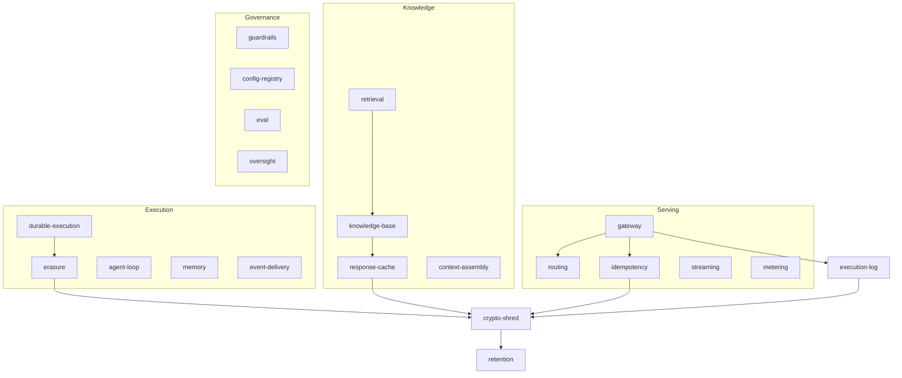

# Custodian

An autonomous AI agent platform built so that its compliance guarantees hold by construction rather
than by convention — a tenant cannot name another tenant's data, a request cannot cross a residency
boundary during failover, and an erased subject cannot be recovered from a backup.

[](https://github.com/damionrashford/custodian/actions/workflows/ci.yml)
[](LICENSE.md)

## What this is

Twenty-five packages implementing the serving, retrieval, execution and governance layers an agent
needs before it can run on someone else's data. It is not a framework you install — it is the
infrastructure underneath one, built against a specification that resolves the questions most agent
projects hit later: what happens on the second delivery of a request, where the prompt lives after a
deletion request, which provider is legal to call when the nearest one is down.

Every guarantee is a test. Where a rule could not be encoded in a type, it is a gate that has been
verified to fail — the erasure test is run with the erasure step removed to prove it catches
anything at all.

## Quick start

```bash
bun install
bun run verify
```

`verify` runs the seven blocking gates in order: types, lint, layering, dead code, structure
budgets, formatting, tests. A standing erasure gate runs separately:

```bash
bun run gate:erasure
```

## How it fits together



Every package defines a **port** in `domain` and an **adapter** in `infrastructure`. Dependencies
point inward only, and `dependency-cruiser` fails the build on any violation or cycle — so a
provider swap is a new adapter, never a change to business logic, and the whole platform is
testable without a network.

`crypto-shred` sits under everything that stores content. No store holds plaintext; destroying one
key reaches the log, the cache and the idempotency store at once.

## Project structure

```
src/               27 components, each with four layers and one barrel
  crypto-shred/      per-subject and per-bucket envelope encryption
  execution-log/     hash-chained, append-only record of every run
  erasure/           the nine-step data-subject erasure workflow
  routing/           residency-constrained provider selection
  gateway/           model-provider port, retries, budgets
  …
scripts/           repository checks no linter covers
tests/             every test, mirrored one folder per component
```

Each component is imported as `@custodian/<component>`, mapped to `src/<component>/index.ts` by
`tsconfig` `paths`. That barrel is the component's whole public surface: a file may import another
component's barrel and never its internals, and never its own — enforced by `dependency-cruiser`.

Which component may depend on which is a table in `tests/standards.test.ts`, checked in both
directions, so an undeclared import and an unused declaration each fail the build.

Tests live under `tests/`, not beside their source, and import the barrel — so the tested surface and
the supported surface stay identical.

## Documentation

| Document | What it covers |
|---|---|
| [CLAUDE.md](CLAUDE.md) | Architecture spine, non-negotiables, mandatory tooling |
| [CHANGELOG.md](CHANGELOG.md) | What has shipped, per Keep a Changelog |
| [LICENSE.md](LICENSE.md) | Licence |

## Status

Stages 0–5 are on `main`: toolchain gates, foundations, serving core, knowledge and context, agent
execution, and safety and governance. 214 tests.

Deliberately not built: microVM sandbox isolation, which is a deployment rather than a module;
telemetry and autoscaling; learned router training, which needs captured production traffic; and
any orchestration beyond a single agent, because the specification says to measure the
single-agent ceiling before adding a second one.
